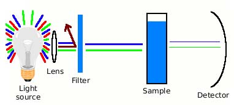

## Theory

<h2>Relevance of this Study:</h2>

Soft drinks are complex mixtures containing a variety of substances such as colouring compounds, flavouring agents, acidifiers, sweeteners, preservatives, and caffeine. The most common acidifier used in soft drinks is phosphoric acid, which gives a tangy taste in the mouth. Phosphoric acid can also act as a preservative, keeping the contents of the bottle fresh.

<h2>Health Effects of Phosphate in Soft Drinks:</h2>

<h3>Cola linked to brittle bones risk:</h3>

“Drinking cola could lead to weaker bones”, experts have said. A US study found that drinking just four cans of regular or diet cola a week led to lower bone density in women — a condition which increases the risk of osteoporosis. Soft drinks have long been suspected of leading to lower calcium levels and higher phosphate levels in the blood. When phosphate levels are high and calcium levels are low, calcium is pulled out of the bones. The phosphate content of soft drinks is very high, and they contain virtually no calcium. Phosphoric acid contained in some soft drinks displaces calcium from the bones, lowering bone density and leading to weakened bones.

<h3>Dental Decay:</h3>

The pH of a soft drink ranges from 2.47–3.35. The pH in our mouth is normally about 6.2 to 7.0, slightly more acidic than water. At a pH of 5.2 to 5.5 or below, acid begins to dissolve the hard enamel of our teeth. Because good health depends upon our bodies being able to maintain a one-to-one balance between calcium and phosphorus in our systems, calcium is released from our teeth. Eventually the phosphoric acid is excreted, taking with it the released calcium. Thus, a habit of soft drink consumption actually robs our bodies of calcium, leading to soft teeth.

<h3>Stomach Problems:</h3>

When you open the bottle of a soft drink, bubbles and fizz are immediately emitted. This is due to phosphoric acid and carbon dioxide (CO₂) content, which make these drinks highly acidic. The pH of soft drink ranges from 2.5–3.4, generating a highly acidic environment in the stomach. The phosphoric acid present in soft drink reacts with the hydrochloric acid of the stomach and affects its functions. When the stomach becomes ineffective, food remains undigested causing indigestion, gassiness, or bloating (swelling of stomach).

<h3>Effect on Kidneys:</h3>

When the amount of phosphoric acid is excessive, the kidneys are less able to excrete it. Thus, there is extra work for the kidneys. Soft drinks remove calcium from the body, which may get deposited in the kidneys, resulting in kidney stones.

<h4>Other major side effects are:</h4>
<ul>
  <li>Research shows that phosphate, which gives many soft drinks their tangy taste, can accelerate ageing.</li>
  <li>A low calcium-to-phosphorus ratio in the diet increases the incidence of hypertension and the risk of colon-rectal cancer.</li>
</ul>

<h2>Principle:</h2>

Colourimetric analysis for determining the amount of an inorganic compound in solution involves a reaction between an organic reagent and an analyte to form a coloured complex. The reaction can be used to determine analyte concentrations assuming the colour intensity and absorbance is proportional to the analyte concentration.

Phosphate ion (PO₄³⁻) reacts with molybdic acid (H₂MoO₄) to form phosphomolybdate, a complex ion [PMo₁₂O₄₀]³⁻.

The phosphomolybdate on reduction forms another complex, called molybdenum blue, which can be monitored colourimetrically.

<h2>Principle of Colourimetry:</h2>

A colourimeter can be used to measure any test substance that is itself coloured or can be reacted to produce a colour.

It is a device consisting of:

<ol>
  <li>A light source,</li>
  <li>Some optics for focusing the light,</li>
  <li>A coloured filter, which passes light of the colour absorbed by the treated sample,</li>
  <li>A sample compartment to hold a transparent tube or cell containing the sample, and</li>
  <li>A light-sensitive detector.</li>
</ol>

Simplified diagram of a colourimeter

<h2>Beer-Lambert Law:</h2>

The Beer-Lambert Law relates the absorption of light at a particular wavelength to the concentration of the substance that is absorbing the light as follows:

<strong>Where,</strong>

<ul>
  <li><strong>A</strong> is the absorption at a particular wavelength.</li>
  <li><strong>ε</strong> is the molar absorption coefficient for the compound at the wavelength at which the absorption is measured and is characteristic for the compound. This constant is a measure of how strongly a compound absorbs at a particular wavelength.</li>
  <li><strong>c</strong> is the concentration of the compound and is independent of wavelength.</li>
  <li><strong>l</strong> is the path length of the test tube used to hold the sample.</li>
</ul>

To estimate the amount of phosphate in a soft drink sample, one first constructs a graph from stock solutions of phosphate. The absorbance associated with a set of phosphate solutions of known concentrations is called a <strong>phosphate standard curve</strong>.

The amount of phosphate in the sample solution can be determined from the standard curve by drawing a horizontal line on the graph parallel to the X-axis, corresponding to the absorbance of the soft drink sample. This line will intersect the standard curve. At this intersection, a vertical line is drawn to the X-axis. This point corresponds to the volume of phosphate in the sample solution.

